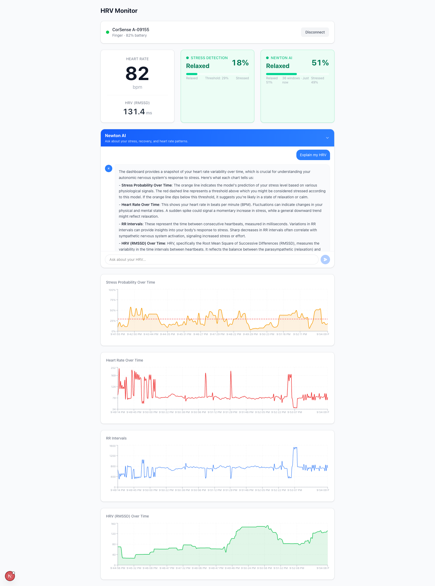

# HRV Stress Monitor

Real-time heart rate variability monitoring with ML-based stress detection, running entirely in the browser.

Connect any Bluetooth heart rate monitor, view live HRV metrics, and get stress predictions from a LightGBM model trained on the [WESAD dataset](https://archive.ics.uci.edu/dataset/465/wesad+wearable+stress+and+affect+detection). Optionally, enable **Newton** (powered by [Archetype AI](https://www.archetypeai.io/)) for continuous AI-powered stress classification and a conversational AI chat that can answer open-ended questions about your HRV data.



## How It Works

1. Connects to a BLE heart rate monitor via Web Bluetooth
2. Streams RR intervals (beat-to-beat timing) in real-time
3. Computes 18 HRV features from a 30-second sliding window:
   - **Time-domain**: mean RR, SDNN, RMSSD, pNN50, heart rate stats
   - **Non-linear**: Poincare SD1/SD2
   - **Frequency-domain**: LF/HF power via Lomb-Scargle periodogram
4. Runs the features through 100 LightGBM decision trees (in-browser, no server)
5. Classifies as **Relaxed** or **Stress Detected** based on an optimized threshold

## Quick Start

```bash
cd web
npm install
npm run dev
```

Open **http://localhost:3000** in Chrome or Edge (Web Bluetooth is not supported in Firefox/Safari).

Click **Connect HR Monitor** and select your device from the browser's Bluetooth picker.

### Enabling Newton (optional)

To enable the AI features, create `web/.env.local` with your [Archetype AI](https://console.u1.archetypeai.app/) credentials:

```
ATAI_API_KEY=your_api_key
ATAI_API_ENDPOINT=https://api.u1.archetypeai.app/v0.5
```

When configured, two Newton features appear after you connect a device:

- **Newton AI indicator card** — real-time classification (Stressed/Relaxed) that updates automatically every ~15 seconds using the Machine State Lens
- **Newton AI chat panel** — collapsible chat where you can ask open-ended questions like "Am I stressed?", "Should I work out today?", or "Explain my HRV". Newton captures screenshots of your live charts, converts them to video, and sends them to Archetype AI's Activity Monitor lens for genuine vision-based analysis.

Without these keys, the app works exactly as before.

**Requires `ffmpeg`** on the server for the chat feature (converts chart screenshots to video).

## Compatible Devices

Any Bluetooth Low Energy heart rate monitor that supports the standard [Heart Rate Profile](https://www.bluetooth.com/specifications/specs/heart-rate-profile-1-0/) and reports RR intervals, including:

- Elite CorSense / HRV Sensor
- Polar H10 / H9 / Verity Sense
- Garmin HRM-Pro / HRM-Dual
- Wahoo TICKR / TICKR FIT
- CooSpo / Magene chest straps

## Project Structure

```
hrv/
├── web/                        # Next.js app (what users run)
│   ├── app/page.tsx            # Main dashboard
│   ├── components/             # UI components
│   │   ├── connection-panel    # BLE connect/disconnect
│   │   ├── heart-rate-display  # Live HR + RMSSD display
│   │   ├── stress-indicator    # Stress prediction card
│   │   ├── newton-indicator    # Newton AI real-time classification card
│   │   ├── newton-chat         # Newton conversational AI chat (collapsible)
│   │   ├── stress-chart        # Stress probability over time
│   │   ├── hr-chart            # Heart rate chart
│   │   ├── rr-chart            # RR interval chart
│   │   └── rmssd-chart         # RMSSD chart
│   ├── hooks/
│   │   ├── use-heart-rate      # BLE connection + data streaming
│   │   ├── use-stress-prediction # Sliding window + inference
│   │   ├── use-newton          # Newton chat state + chart capture + API calls
│   │   └── use-newton-stream   # Newton streaming classification + SSE
│   ├── app/api/newton/         # Newton API routes (server-side)
│   │   ├── status/route.ts     # GET — checks if Newton is configured
│   │   ├── query/route.ts      # POST — vision-based chat via Activity Monitor lens
│   │   └── stream/             # Streaming classification endpoints
│   │       ├── route.ts        # GET — SSE stream for classification results
│   │       ├── start/route.ts  # POST — starts periodic classification
│   │       ├── stop/route.ts   # POST — stops periodic classification
│   │       ├── data/route.ts   # POST — receives batched RR intervals
│   │       └── result/route.ts # GET — returns latest classification result
│   └── lib/
│       ├── ble-constants       # Standard BLE UUIDs
│       ├── parse-heart-rate    # BLE characteristic parser
│       ├── hrv.ts              # RMSSD calculation
│       ├── hrv-features        # Full 18-feature extraction
│       ├── stress-predictor    # LightGBM tree traversal
│       ├── stress-model-data.json # Exported model trees + scaler
│       ├── capture-charts      # html2canvas chart screenshot capture
│       └── newton-stream       # Newton streaming singleton (server-side)
│
├── models/                     # Trained model files
│   ├── stress_model.joblib     # LightGBM model (Python)
│   ├── stress_scaler.joblib    # StandardScaler (Python)
│   └── stress_config.json      # Config, metrics, feature importances
│
├── train_stress_model.py       # Training pipeline (WESAD dataset)
└── export_model_trees.py       # Export model to JSON for browser
```

## Model Details

- **Algorithm**: LightGBM (100 trees, max depth 3, learning rate 0.05)
- **Training**: Leave-One-Subject-Out cross-validation on 15 WESAD subjects
- **Task**: Binary classification — stress vs non-stress (baseline + amusement)
- **Threshold**: 0.29 (optimized for F1)

| Metric    | Value |
|-----------|-------|
| AUC       | 0.708 |
| F1        | 0.575 |
| Accuracy  | 0.618 |
| Precision | 0.456 |
| Recall    | 0.778 |

Top features by importance: mean RR, rr_coverage, mean HR, HF power, SD2.

## Retraining the Model

To retrain on the WESAD dataset:

1. Download from [Kaggle](https://www.kaggle.com/datasets/orvile/wesad-wearable-stress-affect-detection-dataset?resource=download) (also available from [UCI](https://archive.ics.uci.edu/dataset/465/wesad+wearable+stress+and+affect+detection))
2. Extract to `data/WESAD/` so the structure is `data/WESAD/S2/`, `data/WESAD/S3/`, etc.

```bash

python3 -m venv venv
source venv/bin/activate
pip install numpy scipy pandas scikit-learn joblib xgboost lightgbm

python train_stress_model.py      # Train + export to models/
python export_model_trees.py      # Convert to JSON for browser
```

## Newton (Archetype AI)

Newton is **entirely optional**. Without `ATAI_API_KEY` and `ATAI_API_ENDPOINT` in `web/.env.local`, the app works fully — the Newton features simply don't appear. The `/api/newton/status` endpoint returns `available: false`, and the frontend hides the panels.

### Three ML models

The app runs up to three independent AI systems:

| | LightGBM (in-browser) | Newton Indicator (Machine State Lens) | Newton Chat (Activity Monitor) |
|---|---|---|---|
| **Runs** | Client-side, real-time | Server-side, every 15s | On-demand (user asks) |
| **Lens** | — | Machine State Lens | Activity Monitor |
| **Input** | 18 HRV features | RR intervals as CSV | Chart screenshots as video |
| **Output** | Stress probability % | Stressed/Relaxed % | Free-form AI text |
| **Approach** | 100-tree gradient boosting | N-shot KNN classification | Newton vision model (2B params) |
| **Latency** | Instant | ~1-2s (after ~30s cold start) | ~30-70s |
| **Requires API** | No | Yes | Yes + ffmpeg |

### Newton Indicator — streaming classification

The Newton AI indicator card uses the **Machine State Lens** for continuous stress classification via a server-side singleton (`NewtonStreamManager`) that reuses a persistent Archetype AI lens session:

```
Browser (BLE)                    Next.js Server                    Archetype AI
─────────────                    ──────────────                    ────────────
CorSense HR
    │
use-heart-rate (RR intervals)
    │
use-newton-stream
    ├── POST /stream/data ──▶ NewtonStreamManager ──▶ Machine State Lens
    │   (batch RR every 5s)      │  (query every 15s)      │
    │                            │  session reuse           ▼
    └── EventSource ◀──── GET /stream (SSE) ◀──── Classification
        (instant push)                              results
```

**First query (~25-30s):** Full session setup — upload focus CSVs (cached), create lens session, configure n-shot + CSV parsing + SSE output. This session is then **reused** for all subsequent queries.

**Subsequent queries (~1-2s):** Only upload a new data CSV, set the input stream, and read SSE results. The session configuration (n-shot references, output format) persists across queries.

**Early SSE termination:** The expected number of classification windows is calculated from the data size (`(dataPoints - windowSize) / stepSize + 1`). Once all expected windows arrive, the SSE connection is closed immediately — without this, Archetype AI holds the stream open for 60-80 additional seconds before sending `sse.stream.end`.

### Newton Chat — vision-based Q&A

The Newton AI chat panel uses the **Activity Monitor lens** with Newton's generative vision model to answer open-ended questions about your HRV data:

```
Browser                          Next.js Server                    Archetype AI
───────                          ──────────────                    ────────────
User asks question
    │
html2canvas captures 4 charts
(Stress, HR, RR, RMSSD)
    │
POST /api/newton/query ──▶ ffmpeg: PNG → MP4 video
    │                           │
    │                      Upload video to Archetype AI
    │                           │
    │                      Activity Monitor lens session
    │                      (focus: HRV dashboard context)
    │                      (instruction: user's question)
    │                           │
    ◀──────────────────── Newton vision model analyzes
                          charts and returns free-form
                          AI response
```

**How it works:**
1. User asks a question (e.g., "Explain my HRV", "Am I stressed?")
2. `html2canvas` captures screenshots of all 4 chart components
3. Screenshots are composited into a 2×2 grid PNG
4. Server converts PNG to a 10-second MP4 video via `ffmpeg`
5. Video is uploaded to Archetype AI and fed to the Activity Monitor lens
6. Newton's 2B-parameter vision model analyzes the charts and returns a detailed natural language response
7. Response is displayed with markdown formatting (paragraphs, lists, bold text)

Unlike the indicator (which uses template classification), the chat provides genuine AI analysis — Newton reads and interprets the actual chart visualizations.

### Archetype AI API flow

**Indicator — per-query (reused session, 3 API calls):**
1. `POST /files` — Upload user data CSV with rolling HRV features
2. `POST /lens/sessions/events/process` — Set `input_stream` to the new CSV
3. `GET /lens/sessions/consumer/{session_id}` — Read `inference.result` SSE events

**Indicator — first-time setup (adds 4 more calls):**
1. `POST /files` (×2) — Upload focus-relaxed.csv and focus-stressed.csv (cached after first upload)
2. `POST /lens/sessions/create` — Create a new Machine State Lens session
3. `POST /lens/sessions/events/process` — `session.modify` with n-shot file IDs and CSV config
4. `POST /lens/sessions/events/process` — `output_stream.set` to enable SSE output

**Chat — per-query (new session each time, 6 API calls):**
1. `POST /files` — Upload chart video (MP4)
2. `POST /lens/sessions/create` — Create Activity Monitor session
3. `POST /lens/sessions/events/process` — `session.modify` with focus + instruction
4. `POST /lens/sessions/events/process` — `output_stream.set` (before input to avoid race)
5. `POST /lens/sessions/events/process` — `input_stream.set` with `video_file_reader`
6. `GET /lens/sessions/consumer/{session_id}` — Read `inference.result` SSE event

**Cleanup on disconnect:**
- `POST /lens/sessions/destroy` — Tears down sessions
- `DELETE /files/delete/{file_id}` — Deletes uploaded files

### Current limitations

- **No true real-time streaming:** The Archetype AI Sensor API (`POST /sensors/register`) returns 500 errors — it's not available for the current API key/plan. This prevents WebSocket-based real-time data streaming to the platform. Instead, we batch RR intervals and run periodic lens queries.
- **Chat latency (~30-70s):** The Activity Monitor lens + Newton vision model takes 30-70 seconds to analyze chart screenshots. This is the model inference time, not a bug.
- **Indicator confidence is low:** N-shot classification via the Machine State Lens typically produces 50-60% confidence scores, compared to 70-95% from the trained LightGBM model. The lens is a general-purpose classifier, not specialized for HRV.
- **Indicator cold start (~30s):** The initial lens session setup takes ~25-30s. Subsequent queries complete in ~1-2s thanks to session reuse.
- **ffmpeg dependency:** The chat feature requires `ffmpeg` installed on the server to convert chart screenshots to video.

### Future improvements

- **True sensor streaming:** If/when the Archetype AI Sensor API becomes available, replace periodic batch queries with WebSocket-based real-time streaming for sub-second classification latency.
- **Session reuse for chat:** Reuse the Activity Monitor lens session across chat queries (like the indicator does) to reduce API calls and potentially speed up responses.
- **Custom lens:** Register a custom lens via `POST /lens/register` with a model tuned for HRV classification.

### Focus data

The focus CSVs (`web/data/focus-relaxed.csv`, `web/data/focus-stressed.csv`) contain real physiological data from the WESAD dataset, selected by scoring segments for physiological correctness:

- **Relaxed**: high RMSSD, low heart rate (score = RMSSD - mean HR)
- **Stressed**: high heart rate, low RMSSD (score = mean HR - RMSSD)

Top 3 subjects per class are selected and concatenated (128 beats each = 384 rows per file). To regenerate from WESAD source data, run `python extract_focus_csv.py`.

## Tech Stack

- **Frontend**: Next.js 16, React 19, TypeScript, Tailwind CSS 4
- **Charts**: Recharts
- **BLE**: Web Bluetooth API
- **ML (local)**: LightGBM (trained in Python, inference in TypeScript)
- **ML (cloud, optional)**: Archetype AI — Machine State Lens (classification) + Activity Monitor (vision Q&A)
- **Chart capture**: html2canvas-pro
- **Video conversion**: ffmpeg
